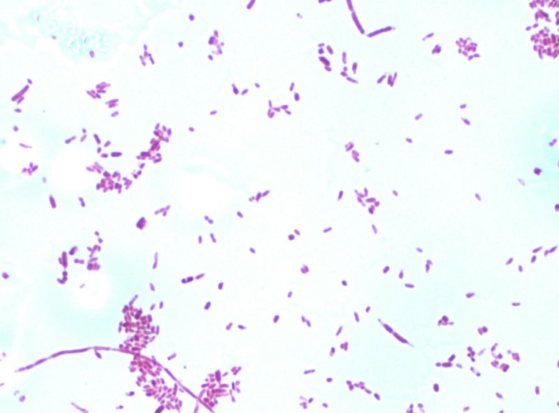
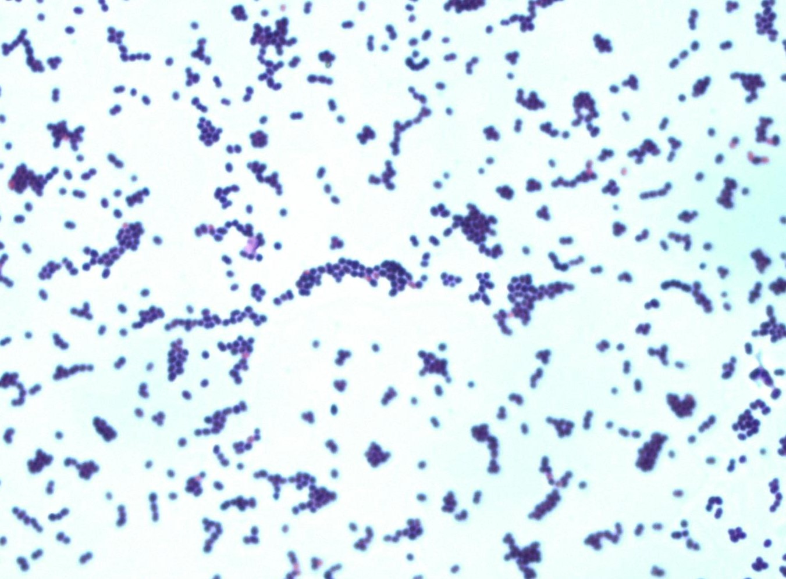
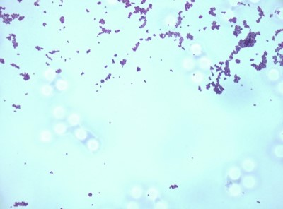

## Bacteria classification
This project illustrates the implementation of two types of deep network for image classification task: ResNet and EfficientNet. 
The first one, ResNet, was modified via scaling coefficient, corresponding to the number of residual layers in architecture. Changing this hyperparmater in [config file](config.yaml) the depth of network can be varied (and the total number of weights therefore)

## Dataset
For the data were selected the images from Medical Microscopy field, Gram Stain bacteria populations. 3 different types of such bacteria were chosen: Negative Bacilli, Cocci Chains and Cocci Clumps. Each image contains multiple bacteria cells, but all of them belong to one of the types above.

*NEGATIVE BACILLI*


*COCCI CHAINS*


*COCCI CLUMPS*

The structure of the source dataset should be as this:
   ```
    -- data
        -- COCCI CHAINS
            |-- 1.jpg
            |-- 2.jpg
            ...
            ...
        -- COCCI CLUMPS
            |-- 1.jpg
            |-- 2.jpg
            ...
        -- NEGATIVE BACILLI
            |-- 1.jpg
            |-- 2.gpg
            ...
   ```
To create a training and test dataset, you should run the folowing script:
```
python prepare.py $path_to_data$
```
## Training

Training script requires 2 arguments: 

1) net type which is either "res" or "eff"
2) path to the dataset, where the subsets "train" and "test" were already created.

For example, if you want to train ResNet and your dataset called "data", which located at the same level as this project, then the command
would be:
```
python train/train.py res ../data
```

## Evaluation
Note that the network was trained on sub-images of the original ones by splitting with 2 x 2 grid. In order to estimate the accuracy of the network on test dataset,
run the following:
```
python evaluate.py res ../data
```
If you want to test on the whole images, run
```
python test_images.py res ../data
```
It will automatically split the images in the same way as the training dataset was created. The resulting prediction on the image is given as the class having the maximal sum of the corresponding probabilities over sub-images of the given image.
