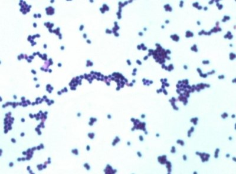

## Bacteria classification
This project illustrates the implementation of two types of deep network for image classification task: ResNet and EfficientNet. 
The first one, ResNet, was modified via scaling coefficient, corresponding to the number of residual layers in architecture. Changing this hyperparmater in [config file](config.yaml) the depth of network can be varied (and the total number of weights therefore)

## Dataset
For the data were selected the images from Medical Microscopy field, Gram Stain bacteria populations. 3 different types of such bacteria were chosen: Negative Bacilli, Cocci Chains and Cocci Clumps. Each image contains multiple bacteria cells, but all of them belong to one of the types above.

*NEGATIVE BACILLI*


*COCCI CHAINS*



*COCCI CLUMPS*


The structure of the dataset has the following format
   ```
   ${dataset name}
      -- COCCI CHAINS
          |-- 1.jpg
          |-- 2.jpg
          ...
      -- COCI CLUMPS
          |-- 1.jpg
          |-- 2.jpg
          ...
      -- NEGATIVE BACILLI
          |-- 1.jpg
          |-- 2.jpg
          ...
   ```
